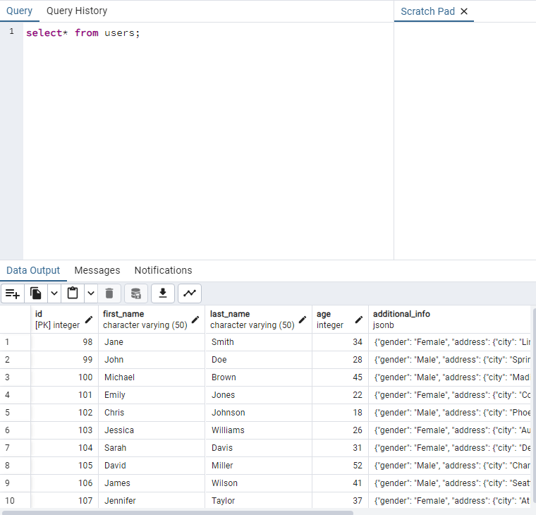
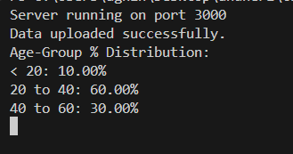
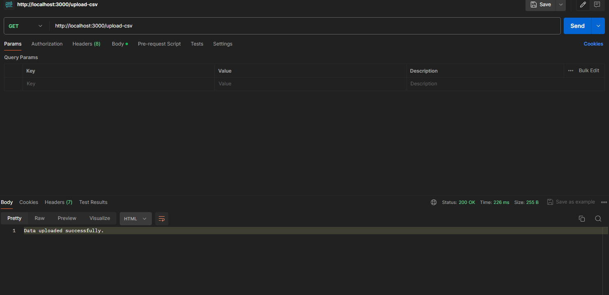
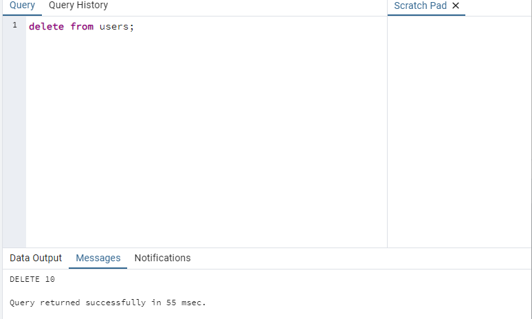

### Getting Started
Large CSV Parser and DB Uploader
This Node.js application is designed to efficiently parse large CSV files with complex, deeply nested properties and upload the processed data into a PostgreSQL database. It uses streaming for parsing to accommodate large files and batch processing for efficient database insertion.


```markdown
###Features

1. Streaming CSV Parsing: Handles large CSV files without overwhelming memory resources.
2. Nested Property Support: Parses CSV columns with infinite depth nested properties (e.g., a.b.c...z).
3. Efficient Database Upload: Utilizes batch inserts for better performance with large datasets.
4. Flexible Data Handling: Supports a mix of flat and nested data, suitable for a variety of CSV formats.


###Prerequisites

- Node.js (Version 14 or later recommended)
- PostgreSQL (Version 10 or later recommended) 
- A PostgreSQL database setup and accessible
- CSV files conforming to the application's expected format
```

Setup

1. Clone the Repository
```bash
git clone https://github.com/agnihotri099/Kelp-Global
cd large-csv-parser
```

2. Install Dependencies
```bash
npm install
```
3. Configure Environment

   Create a .env file in the root of the project with the following content, adjusted to match your database configuration:
```bash
DB_HOST=localhost
DB_USER=your_username
DB_PASS=your_password
DB_NAME=your_database
DB_PORT=5432
CSV_FILE_PATH=./path_to_your_csv_file.csv
```

4. Database Setup
```bash
   Ensure your PostgreSQL database is set up and running. Create the necessary table(s) as per your application schema. 
```


5. Usage

   To run the application and upload data from your CSV file to the database:

```bash
node app.js
```

6 . Screenshot

- Displaying users



- Console Output



- Postman url



- delete users


